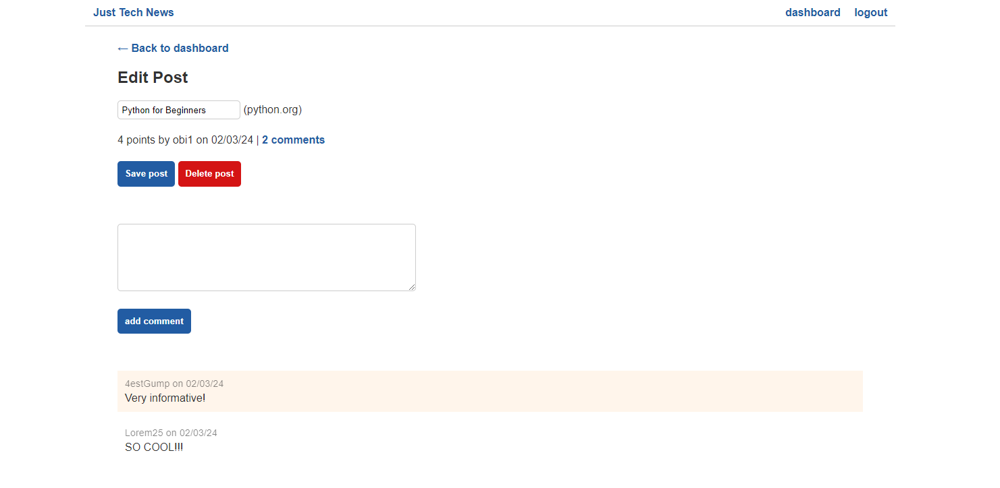

# Python Newsfeed

The application, Just Tech News, is a website where users can post, upvote, and comment on links to news articles.

## Deployed Site

### [Heroku](https://python-newsfeed-23a9d73af023.herokuapp.com/)

## Images

### Homepage

### Login

### User Creating Post

### User Editing Post

